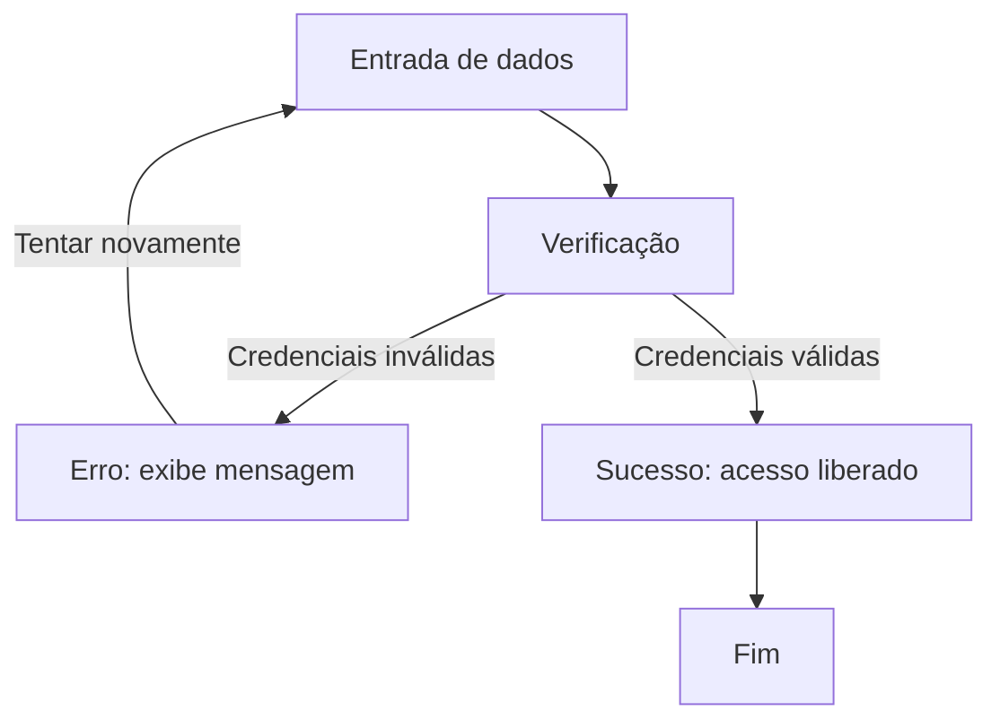

## Exercício 5: Diagrama de Fluxo do Login
 
!!! example "Enunciado"
    Crie um diagrama de fluxo que represente o processo de login em um sistema (entrada de dados, verificação, sucesso/erro).
 

 
!!! tip "Explicação"
    O fluxo começa na **entrada de dados**, passa pela **verificação** das credenciais e se divide em dois caminhos: se inválidas, retorna um **erro** e permite nova tentativa; se válidas, segue para o **sucesso** e finaliza o processo.